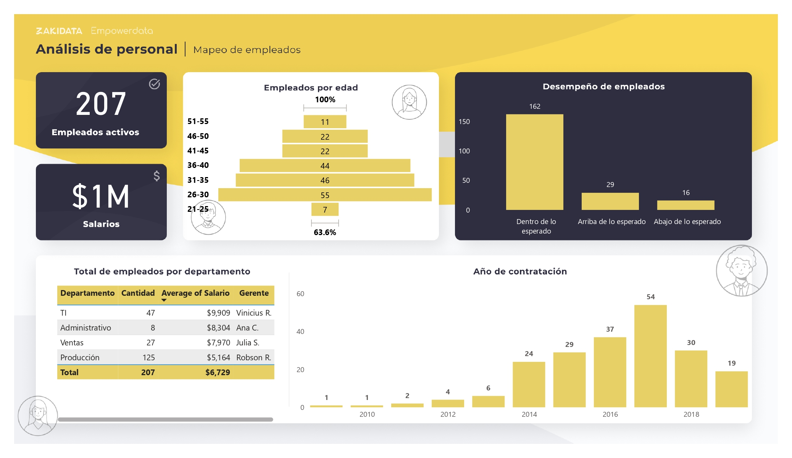

# 👥 Dashboard de Recursos Humanos – Análisis de la Plantilla

Este repositorio contiene un dashboard de **Recursos Humanos** desarrollado en **Power BI**, cuyo objetivo es analizar la plantilla de empleados, su distribución, desempeño, salarios y evolución en contrataciones.  
El dashboard permite a los líderes de RR.HH. y dirección tener una visión clara del estado de la fuerza laboral para apoyar la toma de decisiones estratégicas.  

---

## 📂 Contenido del repositorio
- `Dashboard_RRHH.pbix` → archivo de Power BI.  
- `bd_integrantes_Esp.xlsx` → base de datos utilizada.  
- Captura del dashboard.  

---

## 📊 Resumen de la plantilla
- **Total de empleados activos:** 207  
- **Distribución por sexo:**  
  - 👩 Femenino: **176 (56.6%)**  
  - 👨 Masculino: **135 (43.4%)**  
- **Antigüedad promedio:** 4 años  

---

## 💰 Salarios y desempeño
- **Salario promedio:** $7,836
- **Salario más alto:** $9,909 (TI)  
- **Salario más bajo:** $5,164 (Producción)  

---

## 📈 Contrataciones por año
El año con el mayor número de contrataciones fue **2018** con un total de **62 empleados**.

| Año | Contrataciones |
|-----|----------------|
| 2014 | 24 |
| 2015 | 29 |
| 2016 | 37 |
| 2017 | 54 |
| 2018 | 30 |
| 2019 | 19 |

---

## 🖥️ Vista previa

---

## 🚀 Cómo usar este repositorio
1. Descarga el archivo `.pbix`.  
2. Abre el proyecto en **Power BI Desktop**.  

---

## 💡 Insights principales
- La **plantilla está compuesta en un 56.6% por mujeres** y 43.4% por hombres.  
- El **salario promedio** es de **$7,836**.  
- El **desempeño predominante** es *Dentro de lo esperado* en todos los departamentos.  
- **2017** fue el año con mayor crecimiento en contrataciones.  

---
